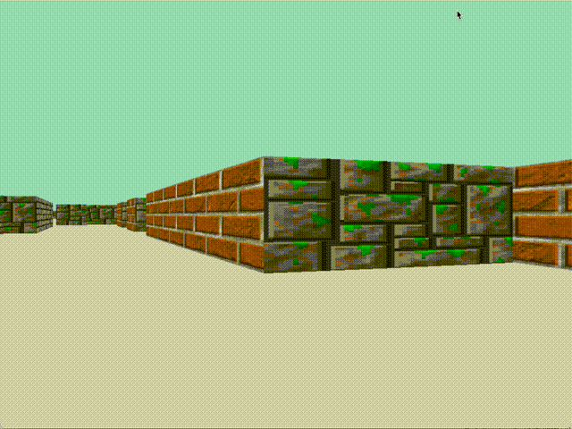

# Cub3D

Cub3D is a project that demonstrates the creation of a basic 3D game environment using raycasting principles, inspired by the classic game Wolfenstein 3D.

<p align="center">
  
  
</p>

## Introduction

Raycasting is a rendering technique used to create a 3D perspective in a 2D map by casting rays from the player's viewpoint and calculating the distance to the nearest wall. This method was famously used in the game Wolfenstein 3D, developed by Id Software and released in 1992, which is considered the first true first-person shooter.

## Features

### Normal Version
**Movement**: Use W, A, S, D to move around.  
**Looking Around**: Use the arrow keys to look around.  
**Customizable Maps and Textures:** The map file specifies textures for the north, west, south, and east walls, as well as the color of the ceiling and floor.  
### Bonus Version
**Shooting**: Press F to shoot.  
**Weapon Switching**: Press R to change weapons.  
**Jumping**: Press Spacebar to jump.  
**Sprinting**: Hold Shift to sprint.  
**Enemies:** Enemies are animated and will follow the player.  


## Installation

Clone the repository:
```
git clone https://github.com/btoksoez/cub3d.git
```
Navigate to the project directory:
```
cd cub3d
```
Compile the project:
```
make
```
or
```
make bonus
```

## Usage

To run the game, use the following command:  
To play the normal version:
```
./cub3D assets/maps/2_normal/map2.cub
```
To play the bonus version:
```
./cub3D_bonus maps/bonus_map.cub
```

## Explanation

### Map Reading
The map is first read as a 2D array where each cell represents a part of the environment (walls, open space, etc.). This 2D map is then used to perform raycasting.

### Raycasting and DDA Algorithm
Raycasting involves projecting rays from the player's viewpoint and calculating where they intersect with walls. The DDA (Digital Differential Analyzer) algorithm is used to calculate the distance to the walls efficiently.

#### Raycasting Function

```
void raycast(t_game *game, t_raycaster *ray) {
    t_player *player;
    t_ray_tools r;
    int x;

    init_ray_tools(&r);
    player = game->player;
    r.angle = player->p_angle - (PLAYER_VISION / 2);
    x = 0;
    while (r.angle < player->p_angle + (PLAYER_VISION / 2)) {
        r.distance = cast_ray(game, r.angle, ray);
        r.adjusted = r.distance * cos(r.angle - player->p_angle);
        r.wall_height = (WALL_SCALE / r.adjusted);
        r.top.y = (HEIGHT / 2) - r.wall_height;
        r.bottom.y = (HEIGHT / 2) + r.wall_height;
        draw_textures(game, x, r.top.y, r.bottom.y);
        draw_vline(game, x, r.bottom.y, HEIGHT);
        draw_vline(game, x, 0, r.top.y);
        r.angle += (PLAYER_VISION / WIDTH);
        x++;
    }
}
```
#### DDA Algorithm
```
float cast_ray(t_game *game, float angle, t_raycaster *ray) {
    t_player *player;
    int visited;

    visited = 0;
    player = game->player;
    init_ray(ray, player, angle);
    while (!ray->wall) {
        closer_distance(ray, &visited);
        if (game->map->map[ray->map_loc.y][ray->map_loc.x] == WALL)
            check_direction(game, ray, visited);
    }
    game->fraction_x = fmod((ray->start.x + ray->dir.x * ray->len),
            (float)SCALE) / (float)SCALE;
    game->fraction_y = fmod((ray->start.y + ray->dir.y * ray->len),
            (float)SCALE) / (float)SCALE;
    return (ray->len);
}
```
The closer_distance function determines the next grid line the ray intersects with:
```
void closer_distance(t_raycaster *ray, int *visited) {
    if (ray->ray_len.x < ray->ray_len.y) {
        *visited = 1;
        ray->len = ray->ray_len.x;
        ray->ray_len.x += ray->scalingf.x * SCALE;
        ray->map_loc.x += ray->map_step.x;
    } else {
        *visited = 2;
        ray->len = ray->ray_len.y;
        ray->ray_len.y += ray->scalingf.y * SCALE;
        ray->map_loc.y += ray->map_step.y;
    }
}
```
The check_dir function sets the step direction and initial distance to the next grid line:
```
void check_dir(t_raycaster *ray) {
    if (ray->dir.y < NORTH_) {
        ray->map_step.y = -1;
        ray->ray_len.y = (ray->start.y - ray->map_loc.y * SCALE)
            * ray->scalingf.y;
    } else {
        ray->map_step.y = 1;
        ray->ray_len.y = ((ray->map_loc.y + 1) * SCALE - ray->start.y)
            * ray->scalingf.y;
    }
    if (ray->dir.x < WEST_) {
        ray->map_step.x = -1;
        ray->ray_len.x = (ray->start.x - ray->map_loc.x * SCALE)
            * ray->scalingf.x;
    } else {
        ray->map_step.x = 1;
        ray->ray_len.x = ((ray->map_loc.x + 1) * SCALE - ray->start.x)
            * ray->scalingf.x;
    }
}
